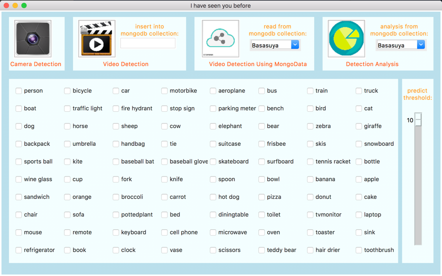
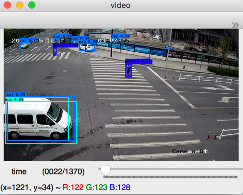

# basasuya-yolo3

[](LICENSE)

 &nbsp;&nbsp;&nbsp;&nbsp;&nbsp;&nbsp; 


A Keras implementation of YOLOv3 (Tensorflow backend) inspired by [allanzelener/YAD2K](https://github.com/allanzelener/YAD2K) and [qqwweee/keras-yolo3](https://github.com/qqwweee/keras-yolo3)

---

## Use Official Parameter 

1. Download YOLOv3 weights from [YOLO website](http://pjreddie.com/darknet/yolo/).
2. Convert the Darknet YOLO model to a Keras model.
3. Run YOLO detection.

```
wget https://pjreddie.com/media/files/yolov3.weights
python convert.py yolov3.cfg yolov3.weights model_data/yolo.h5
# yolo.h5 is the netwoerk parameter
```

## Training By Yourself

see https://github.com/qqwweee/keras-yolo3/blob/master/README.md of the training part

---

## Prepare The Environment
1. install python3 and some library(recommend through virtualenv)
```
 pip install -r requirements.txt
```
2. install mongodb

## Run The System
start three terminal and run the next command.
```
$ monogod
```
```
$ cd Visual
$ python3 manage.py runserver 8000
```
```
$ python3 ui.py
```
Wish you enjoy it!
